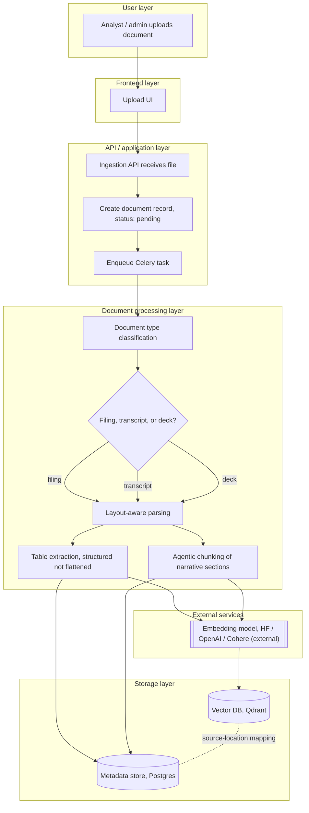
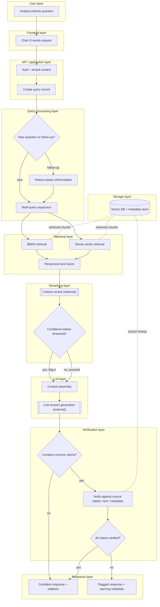
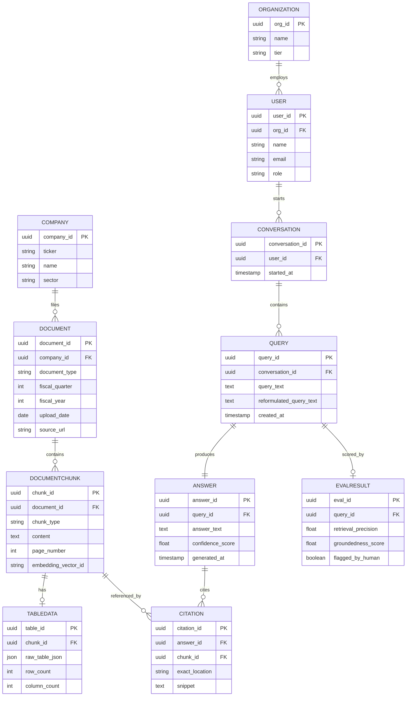
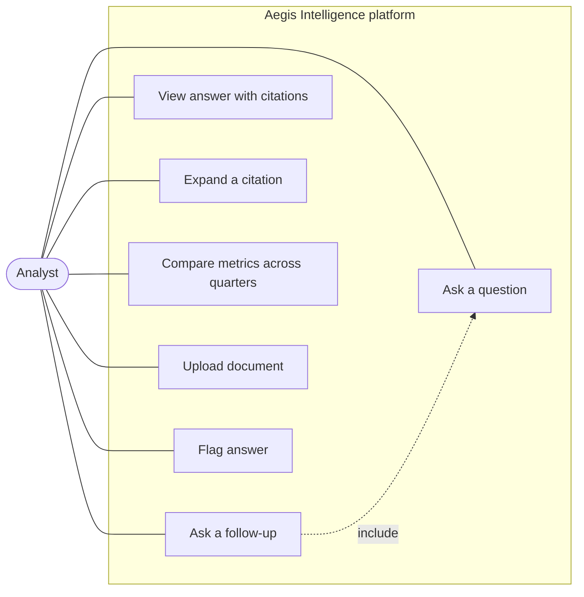
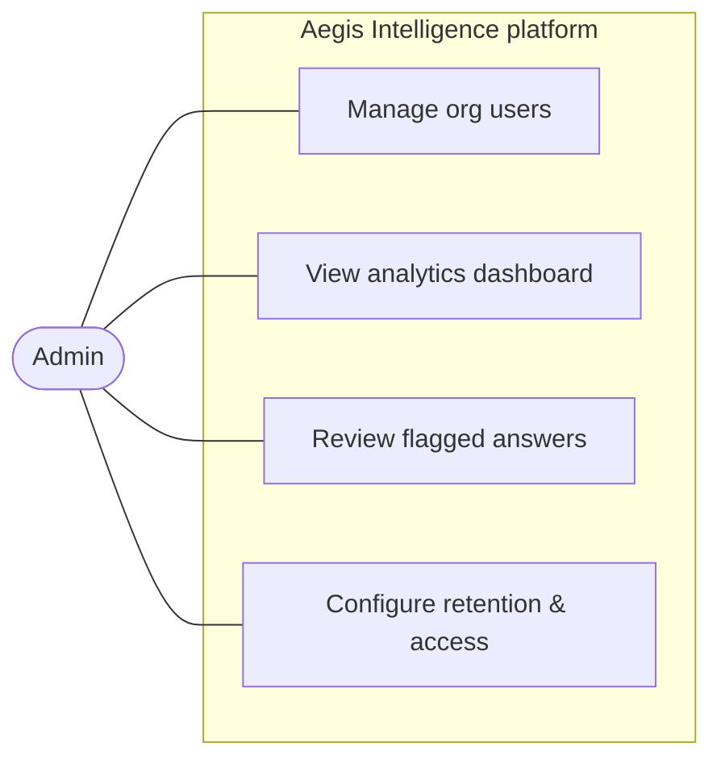
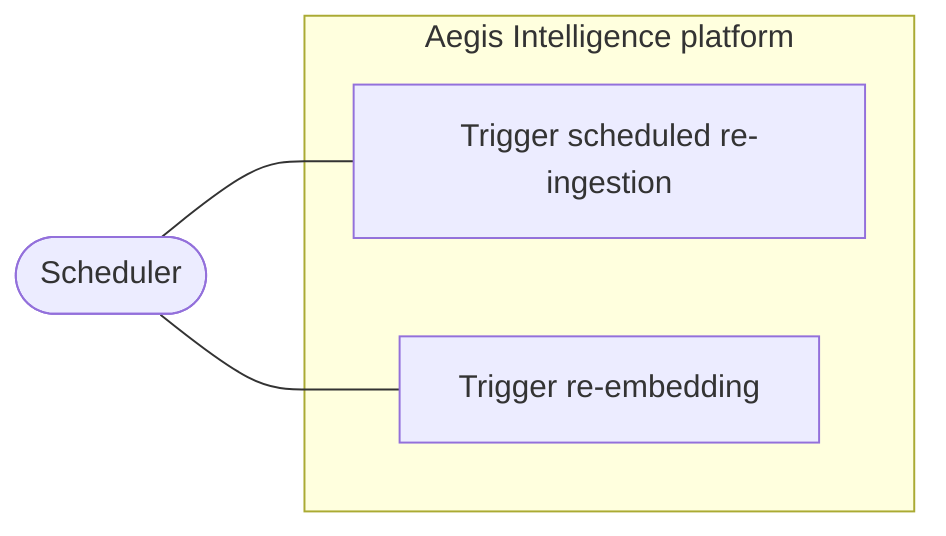

# Financial Research Intelligence Platform — System Flow & Architecture

This document is the written companion to the visual flowchart, ER diagram, and use case diagrams shown in chat. It covers everything the diagrams couldn't show inline: the full swimlaned Mermaid flowcharts, an importable draw.io specification, step-by-step architecture explanation, data flow description, decision points and failure paths, a high-level production deployment architecture, the entity-relationship model, and the use case diagrams by actor. Drop this straight into `docs/architecture.md` in the project structure from earlier.

---

## 1. Architecture Explanation (Step-by-Step)

### Pipeline A — Document Ingestion (offline, batch)

1. **Upload** — An analyst or admin uploads a raw PDF (10-K, 10-Q, earnings call transcript, or investor deck) through the frontend. The API creates a `Document` record with status `pending` and enqueues a Celery task — the API call returns immediately rather than blocking on processing.
2. **Classification** — A worker picks up the task and classifies the document type (filing vs. transcript vs. deck), since each type needs slightly different downstream handling.
3. **Layout-aware parsing** — The document is split into narrative text, financial tables, and footnotes. This is the step that matters most for accuracy: a financial table parsed as plain text loses its row/column relationships, which is exactly what causes numeric hallucinations later.
4. **Table extraction** — Tables are extracted into a structured representation (rows, columns, headers preserved) — never flattened into prose.
5. **Agentic chunking** — Narrative sections (MD&A, risk factors, guidance) are chunked using an LLM-assisted pass that finds logical section boundaries, rather than a fixed character count.
6. **Embedding** — Both narrative chunks and table representations are embedded.
7. **Storage** — Embeddings + light metadata go into the vector DB (Qdrant); richer relational metadata (company, ticker, quarter, document type, exact page/section/source location) goes into the Postgres metadata store. The source-location mapping captured here is what makes citations possible later — this is the single most important design decision in the ingestion pipeline.

### Pipeline B — Query-Time (real-time)

1. **Question intake** — The analyst submits a natural-language question. The API resolves tenant context and creates a `Query` record linked to the current `Conversation`.
2. **Reformulation** — The system checks whether this is a new question or a follow-up. Follow-ups get rewritten using conversation history (history-aware retrieval) so "and how does that compare to last year?" becomes a self-contained query.
3. **Multi-query expansion** — The (possibly reformulated) question is expanded into several semantic variations and aspect-specific sub-queries, since a single phrasing often misses relevant chunks.
4. **Hybrid retrieval** — BM25 (keyword) and dense vector search run in parallel against the vector DB.
5. **RRF fusion** — Reciprocal Rank Fusion merges the two ranked lists into one.
6. **Reranking** — Cohere rerank reorders the fused candidates by relevance to the actual question.
7. **Confidence check** — If the top results' relevance scores fall below a threshold, the response gets flagged as low-confidence later — but processing continues with the best available evidence either way. This is a soft gate, not a hard stop.
8. **Context assembly** — Narrative chunks, table data, and their source metadata are combined into the context window.
9. **Generation** — The LLM generates an answer constrained to only use the retrieved evidence — no claims beyond what's in the context.
10. **Numeric verification** — If the answer contains numeric claims, each one is checked against the actual source table/text. This is the step that prevents the classic RAG failure mode of a fluent-sounding but wrong number.
11. **Response construction** — The final response bundles the answer text, a confidence indicator, citations, and exact source/page references, then gets delivered to the user.

---

## 2. Data Flow Description

- **Write path (ingestion)**: PDF bytes → parsed layout segments → (table data | narrative chunks) → embeddings → Qdrant (vectors) + Postgres (metadata, source locations). This path is async and idempotent — re-running ingestion on the same document should overwrite, not duplicate.
- **Read path (query)**: Natural-language text → reformulated text → sub-queries → two parallel candidate lists (BM25 hits, dense hits) → one fused list → one reranked list → assembled context (text) → generated answer (text) → verified answer (text + confidence + citation objects) → JSON response to frontend.
- **Cross-cutting**: Every chunk stored during ingestion carries a `source_location` (document ID, page number, and either a table cell reference or a text span). This identifier travels unchanged all the way from retrieval through to the citation objects in the final response — it's never regenerated or re-derived, only passed through. That's what guarantees a citation always points to something real.

---

## 3. Decision Points and Failure Paths

| Decision point | If yes / met | If no / not met |
|---|---|---|
| Document type classified successfully? | Continue to layout-aware parsing | Retry with fallback heuristics (file extension, filename pattern); after N failures, route to a manual-review queue rather than silently mis-parsing |
| Is this a follow-up question? | Apply history-aware reformulation first | Process the question as-is |
| Retrieval confidence above threshold? | Proceed normally | Proceed anyway, but tag the response as low-confidence so the UI can surface a warning |
| Does the answer contain numeric claims? | Run numeric verification | Skip verification, deliver with full confidence |
| Do all numeric claims verify against source? | Deliver confident response | Deliver flagged response with warning metadata and a reduced confidence score |

**Failure paths worth designing for explicitly:**
- **Corrupt or unparseable PDF** → retry queue with exponential backoff → after N attempts, dead-letter queue + alert, rather than failing silently or producing a half-ingested document.
- **Embedding service timeout/rate-limit** → retry with backoff; if the provider is down, fail the ingestion job cleanly (don't partially embed) so it can be safely retried in full.
- **Cohere rerank service unavailable** → fall back to the RRF-fused ranking without reranking, and lower the confidence score automatically (degraded-but-functional, not a hard failure).
- **LLM generation timeout or error** → return a clear "couldn't generate a response, please retry" message rather than a partial or malformed answer; log the failure for the observability dashboard.
- **Rate limit exceeded (per tenant)** → return 429 with a retry-after header, don't queue indefinitely.

---

## 4. Production Deployment Architecture (High-Level)

```
                     ┌─────────────────────┐
                     │   React frontend     │
                     │  (CDN / static host) │
                     └──────────┬───────────┘
                                │ HTTPS
                     ┌──────────▼───────────┐
                     │  Load balancer / ALB  │
                     └──────────┬───────────┘
                                │
                ┌───────────────┴────────────────┐
                │                                  │
     ┌──────────▼──────────┐           ┌──────────▼──────────┐
     │   API service        │           │  Ingestion workers   │
     │   (FastAPI, ECS/      │           │  (Celery, ECS/Cloud  │
     │   Cloud Run, auto-    │           │   Run jobs, auto-    │
     │   scaled)             │           │   scaled)            │
     └──────────┬──────────┘           └──────────┬──────────┘
                │                                  │
     ┌──────────┴──────────────────────────────────┴──────────┐
     │                                                          │
┌────▼─────┐   ┌──────────────┐   ┌──────────────┐   ┌─────────▼────┐
│  Redis    │   │  Qdrant Cloud │   │  Postgres     │   │  External APIs│
│ (queue +  │   │  (vectors)    │   │  (RDS/Cloud   │   │  Cohere, LLM, │
│  cache)   │   │               │   │   SQL, metadata)│   │  embeddings   │
└──────────┘   └──────────────┘   └──────────────┘   └──────────────┘

     Observability: LangSmith / Arize Phoenix (tracing) +
     Prometheus/Grafana or CloudWatch (metrics) + Sentry (errors)

     CI/CD: GitHub Actions → build Docker images → push to ECR/GCR
            → deploy to staging → nightly RAGAS eval gate → promote to prod
```

Key production decisions worth calling out in an interview:
- **API and ingestion scale independently** — a traffic spike in querying shouldn't be bottlenecked by a batch of new filings being ingested, and vice versa.
- **Qdrant and Postgres are both managed services** in production (Qdrant Cloud, RDS/Cloud SQL) rather than self-hosted, to keep the operational surface area realistic for a small team.
- **The eval gate in CI/CD is the MLOps differentiator** — most portfolio RAG projects skip this entirely. Treating retrieval/answer quality as a regression-tested metric, not a one-time check, is what makes this look production-grade rather than tutorial-grade.

---

## 5. Mermaid Flowchart Code

Paste either block into [mermaid.live](https://mermaid.live) or a Markdown file that renders Mermaid (GitHub does this natively) to get the full swimlaned diagram.

### Pipeline A — Document Ingestion



### Pipeline B — Query-Time Retrieval and Generation



---

## 6. Draw.io Compatible Flow Specification

Open [draw.io](https://app.diagrams.net), go to **Extras → Edit Diagram**, delete the placeholder XML, paste the block below, and click OK. This covers the full Query-Time pipeline with decision diamonds, the external-service nodes, and a shared storage node. (For the Ingestion pipeline, the Mermaid code above is the faster source of truth — paste it into a Mermaid-to-drawio converter, or replicate this same node/edge pattern using the steps from Section 1.)

```xml
<mxGraphModel dx="800" dy="600" grid="1" gridSize="10" guides="1" tooltips="1" connect="1" arrows="1" fold="1" page="1" pageScale="1" pageWidth="850" pageHeight="1400" math="0" shadow="0">
  <root>
    <mxCell id="0" />
    <mxCell id="1" parent="0" />

    <mxCell id="n1" value="Analyst submits question" style="rounded=1;whiteSpace=wrap;html=1;fillColor=#f5f5f5;strokeColor=#666666;" vertex="1" parent="1">
      <mxGeometry x="40" y="40" width="200" height="40" as="geometry" />
    </mxCell>
    <mxCell id="n2" value="Chat UI sends request" style="rounded=1;whiteSpace=wrap;html=1;fillColor=#f5f5f5;strokeColor=#666666;" vertex="1" parent="1">
      <mxGeometry x="40" y="110" width="200" height="40" as="geometry" />
    </mxCell>
    <mxCell id="n3" value="Auth + tenant context" style="rounded=1;whiteSpace=wrap;html=1;fillColor=#dae8fc;strokeColor=#6c8ebf;" vertex="1" parent="1">
      <mxGeometry x="40" y="180" width="200" height="40" as="geometry" />
    </mxCell>
    <mxCell id="n4" value="Create query record" style="rounded=1;whiteSpace=wrap;html=1;fillColor=#dae8fc;strokeColor=#6c8ebf;" vertex="1" parent="1">
      <mxGeometry x="40" y="250" width="200" height="40" as="geometry" />
    </mxCell>
    <mxCell id="d1" value="New question or follow-up?" style="rhombus;whiteSpace=wrap;html=1;fillColor=#fff2cc;strokeColor=#d6b656;" vertex="1" parent="1">
      <mxGeometry x="40" y="320" width="200" height="60" as="geometry" />
    </mxCell>
    <mxCell id="n5" value="History-aware reformulation" style="rounded=1;whiteSpace=wrap;html=1;fillColor=#d5e8d4;strokeColor=#82b366;" vertex="1" parent="1">
      <mxGeometry x="320" y="320" width="200" height="40" as="geometry" />
    </mxCell>
    <mxCell id="n6" value="Multi-query expansion" style="rounded=1;whiteSpace=wrap;html=1;fillColor=#d5e8d4;strokeColor=#82b366;" vertex="1" parent="1">
      <mxGeometry x="40" y="410" width="200" height="40" as="geometry" />
    </mxCell>
    <mxCell id="n7" value="BM25 retrieval" style="rounded=1;whiteSpace=wrap;html=1;fillColor=#d5e8d4;strokeColor=#82b366;" vertex="1" parent="1">
      <mxGeometry x="40" y="480" width="200" height="40" as="geometry" />
    </mxCell>
    <mxCell id="n8" value="Dense vector retrieval" style="rounded=1;whiteSpace=wrap;html=1;fillColor=#d5e8d4;strokeColor=#82b366;" vertex="1" parent="1">
      <mxGeometry x="320" y="480" width="200" height="40" as="geometry" />
    </mxCell>
    <mxCell id="n9" value="Reciprocal rank fusion" style="rounded=1;whiteSpace=wrap;html=1;fillColor=#d5e8d4;strokeColor=#82b366;" vertex="1" parent="1">
      <mxGeometry x="180" y="550" width="200" height="40" as="geometry" />
    </mxCell>
    <mxCell id="n10" value="Cohere rerank (external)" style="rounded=1;whiteSpace=wrap;html=1;dashed=1;fillColor=#ffe6cc;strokeColor=#d79b00;" vertex="1" parent="1">
      <mxGeometry x="180" y="620" width="200" height="40" as="geometry" />
    </mxCell>
    <mxCell id="d2" value="Confidence below threshold?" style="rhombus;whiteSpace=wrap;html=1;fillColor=#fff2cc;strokeColor=#d6b656;" vertex="1" parent="1">
      <mxGeometry x="170" y="690" width="220" height="60" as="geometry" />
    </mxCell>
    <mxCell id="n11" value="Context assembly" style="rounded=1;whiteSpace=wrap;html=1;fillColor=#f5f5f5;strokeColor=#666666;" vertex="1" parent="1">
      <mxGeometry x="180" y="780" width="200" height="40" as="geometry" />
    </mxCell>
    <mxCell id="n12" value="LLM answer generation (external)" style="rounded=1;whiteSpace=wrap;html=1;dashed=1;fillColor=#ffe6cc;strokeColor=#d79b00;" vertex="1" parent="1">
      <mxGeometry x="180" y="850" width="200" height="40" as="geometry" />
    </mxCell>
    <mxCell id="d3" value="Contains numeric claims?" style="rhombus;whiteSpace=wrap;html=1;fillColor=#fff2cc;strokeColor=#d6b656;" vertex="1" parent="1">
      <mxGeometry x="180" y="920" width="200" height="60" as="geometry" />
    </mxCell>
    <mxCell id="n13" value="Verify against source" style="rounded=1;whiteSpace=wrap;html=1;fillColor=#f5f5f5;strokeColor=#666666;" vertex="1" parent="1">
      <mxGeometry x="460" y="920" width="200" height="40" as="geometry" />
    </mxCell>
    <mxCell id="d4" value="All claims verified?" style="rhombus;whiteSpace=wrap;html=1;fillColor=#fff2cc;strokeColor=#d6b656;" vertex="1" parent="1">
      <mxGeometry x="460" y="1000" width="200" height="60" as="geometry" />
    </mxCell>
    <mxCell id="out1" value="Confident response + citations" style="rounded=1;whiteSpace=wrap;html=1;fillColor=#d5e8d4;strokeColor=#82b366;" vertex="1" parent="1">
      <mxGeometry x="180" y="1020" width="220" height="40" as="geometry" />
    </mxCell>
    <mxCell id="out2" value="Flagged response + warning" style="rounded=1;whiteSpace=wrap;html=1;fillColor=#f8cecc;strokeColor=#b85450;" vertex="1" parent="1">
      <mxGeometry x="460" y="1100" width="220" height="40" as="geometry" />
    </mxCell>
    <mxCell id="db1" value="Vector DB + metadata store" style="shape=cylinder3;whiteSpace=wrap;html=1;fillColor=#e1d5e7;strokeColor=#9673a6;" vertex="1" parent="1">
      <mxGeometry x="600" y="470" width="200" height="60" as="geometry" />
    </mxCell>

    <mxCell id="e1" style="edgeStyle=orthogonalEdgeStyle;rounded=0;html=1;" edge="1" parent="1" source="n1" target="n2"><mxGeometry relative="1" as="geometry" /></mxCell>
    <mxCell id="e2" style="edgeStyle=orthogonalEdgeStyle;rounded=0;html=1;" edge="1" parent="1" source="n2" target="n3"><mxGeometry relative="1" as="geometry" /></mxCell>
    <mxCell id="e3" style="edgeStyle=orthogonalEdgeStyle;rounded=0;html=1;" edge="1" parent="1" source="n3" target="n4"><mxGeometry relative="1" as="geometry" /></mxCell>
    <mxCell id="e4" style="edgeStyle=orthogonalEdgeStyle;rounded=0;html=1;" edge="1" parent="1" source="n4" target="d1"><mxGeometry relative="1" as="geometry" /></mxCell>
    <mxCell id="e5" value="follow-up" style="edgeStyle=orthogonalEdgeStyle;rounded=0;html=1;" edge="1" parent="1" source="d1" target="n5"><mxGeometry relative="1" as="geometry" /></mxCell>
    <mxCell id="e6" value="new" style="edgeStyle=orthogonalEdgeStyle;rounded=0;html=1;" edge="1" parent="1" source="d1" target="n6"><mxGeometry relative="1" as="geometry" /></mxCell>
    <mxCell id="e7" style="edgeStyle=orthogonalEdgeStyle;rounded=0;html=1;" edge="1" parent="1" source="n5" target="n6"><mxGeometry relative="1" as="geometry" /></mxCell>
    <mxCell id="e8" style="edgeStyle=orthogonalEdgeStyle;rounded=0;html=1;" edge="1" parent="1" source="n6" target="n7"><mxGeometry relative="1" as="geometry" /></mxCell>
    <mxCell id="e9" style="edgeStyle=orthogonalEdgeStyle;rounded=0;html=1;" edge="1" parent="1" source="n6" target="n8"><mxGeometry relative="1" as="geometry" /></mxCell>
    <mxCell id="e10" style="edgeStyle=orthogonalEdgeStyle;rounded=0;html=1;" edge="1" parent="1" source="n7" target="n9"><mxGeometry relative="1" as="geometry" /></mxCell>
    <mxCell id="e11" style="edgeStyle=orthogonalEdgeStyle;rounded=0;html=1;" edge="1" parent="1" source="n8" target="n9"><mxGeometry relative="1" as="geometry" /></mxCell>
    <mxCell id="e12" style="edgeStyle=orthogonalEdgeStyle;rounded=0;html=1;" edge="1" parent="1" source="n9" target="n10"><mxGeometry relative="1" as="geometry" /></mxCell>
    <mxCell id="e13" style="edgeStyle=orthogonalEdgeStyle;rounded=0;html=1;" edge="1" parent="1" source="n10" target="d2"><mxGeometry relative="1" as="geometry" /></mxCell>
    <mxCell id="e14" value="yes, flag it" style="edgeStyle=orthogonalEdgeStyle;rounded=0;html=1;" edge="1" parent="1" source="d2" target="n11"><mxGeometry relative="1" as="geometry" /></mxCell>
    <mxCell id="e15" value="no, proceed" style="edgeStyle=orthogonalEdgeStyle;rounded=0;html=1;" edge="1" parent="1" source="d2" target="n11"><mxGeometry relative="1" as="geometry" /></mxCell>
    <mxCell id="e16" style="edgeStyle=orthogonalEdgeStyle;rounded=0;html=1;" edge="1" parent="1" source="n11" target="n12"><mxGeometry relative="1" as="geometry" /></mxCell>
    <mxCell id="e17" style="edgeStyle=orthogonalEdgeStyle;rounded=0;html=1;" edge="1" parent="1" source="n12" target="d3"><mxGeometry relative="1" as="geometry" /></mxCell>
    <mxCell id="e18" value="no" style="edgeStyle=orthogonalEdgeStyle;rounded=0;html=1;" edge="1" parent="1" source="d3" target="out1"><mxGeometry relative="1" as="geometry" /></mxCell>
    <mxCell id="e19" value="yes" style="edgeStyle=orthogonalEdgeStyle;rounded=0;html=1;" edge="1" parent="1" source="d3" target="n13"><mxGeometry relative="1" as="geometry" /></mxCell>
    <mxCell id="e20" style="edgeStyle=orthogonalEdgeStyle;rounded=0;html=1;" edge="1" parent="1" source="n13" target="d4"><mxGeometry relative="1" as="geometry" /></mxCell>
    <mxCell id="e21" value="yes" style="edgeStyle=orthogonalEdgeStyle;rounded=0;html=1;" edge="1" parent="1" source="d4" target="out1"><mxGeometry relative="1" as="geometry" /></mxCell>
    <mxCell id="e22" value="no" style="edgeStyle=orthogonalEdgeStyle;rounded=0;html=1;" edge="1" parent="1" source="d4" target="out2"><mxGeometry relative="1" as="geometry" /></mxCell>
    <mxCell id="e23" style="dashed=1;edgeStyle=orthogonalEdgeStyle;rounded=0;html=1;" value="reads" edge="1" parent="1" source="db1" target="n7"><mxGeometry relative="1" as="geometry" /></mxCell>
    <mxCell id="e24" style="dashed=1;edgeStyle=orthogonalEdgeStyle;rounded=0;html=1;" value="reads" edge="1" parent="1" source="db1" target="n8"><mxGeometry relative="1" as="geometry" /></mxCell>
    <mxCell id="e25" style="dashed=1;edgeStyle=orthogonalEdgeStyle;rounded=0;html=1;" value="lookup" edge="1" parent="1" source="db1" target="n13"><mxGeometry relative="1" as="geometry" /></mxCell>
  </root>
</mxGraphModel>
```

If the layout looks cramped after pasting, select all (Ctrl/Cmd+A) and run **Arrange → Layout → Vertical Tree** to auto-tidy the positions while keeping all connections intact.

---

## 7. Entity-Relationship Diagram

Eleven entities covering organizations/users, the document/chunk/table hierarchy, and the conversation/query/answer/citation/eval chain. Paste into [mermaid.live](https://mermaid.live) or any Markdown renderer that supports Mermaid (GitHub renders this natively).



**Reading the cardinality:** an organization employs many users; a company files many documents; a document contains many chunks; a chunk has at most one table-data record (only populated when `chunk_type = table`); a user starts many conversations; a conversation contains many queries; a query produces exactly one answer; an answer cites many citations; a chunk can be referenced by many citations across different answers; a query is scored by at most one eval result (only present once the eval suite has run against it).

---

## 8. Use Case Diagrams

Mermaid has no native UML use-case diagram type, so these are written as flowcharts with the system boundary as a subgraph — this is what was rendered as four separate diagrams in chat (split by actor to stay readable), reassembled here as three Mermaid blocks you can drop straight into the repo.

### Analyst



### Admin



### Ingestion scheduler (system actor)



**Note on the include relationship:** "Ask a follow-up" includes "Ask a question" because a follow-up still goes through the same underlying question-answering logic — it's just preceded by history-aware reformulation. That's the one explicit `<<include>>` relationship in this model; the rest are plain actor-to-use-case associations.
